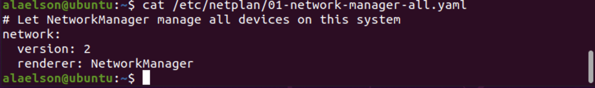
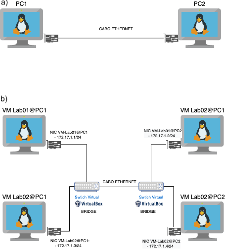
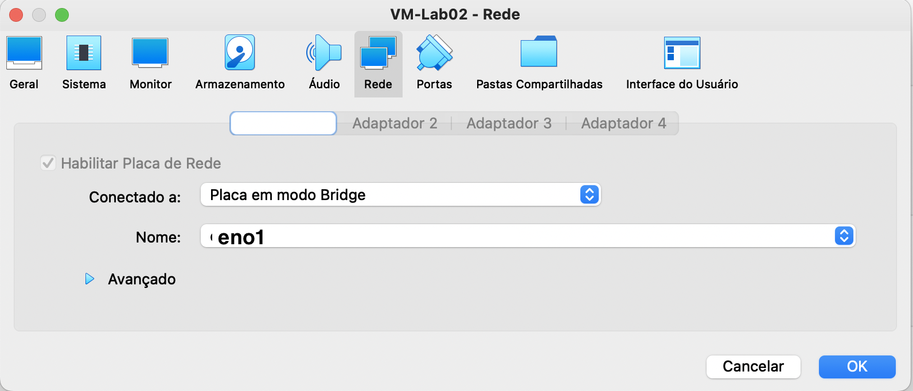

# Criação de uma rede ponto a ponto física entre dois PCs e uma LAN lógica com 4 VMs

## Passo 0 - Terminar toda a prática da [Aula 02](https://github.com/alaelson/labredes_virtualbox/blob/main/Aula2.md).

## Passo 1 - Conexão ponto a ponto 

* Abrir o terminal nos PCs 1 e 2

#### Pelo Terminal dos PCs verifique as configurações de rede

* **Ubuntu Desktop** 
O ubuntu desktop possui uma interface gráfica de configuração própria para setar os endereços IPs. Porém ele continua usando o ``netplan`` em segundo plano. Para isso funcionar no arquivo de configuração de rede deve-se manter a entrada ``renderer:NetworkManager`` diferentemente do ubuntu-server que utiliza ``renderer:networkd``

Ou seja, se o gerenciador de rede do netplan (renderer) estiver setado para ``networkd`` no Ubuntu Desktop, um erro ``Wired Unmanaged error`` irá ser mostrado.

* Netplan

É o gerenciador de interfaces de rede do Ubuntu

Seu arquivo de configuração está na pasta ``/etc/netplan/`` e podem ter os seguintes nomes:
```
01-netcfg.yaml
01-network-manager-all.yaml
50-cloud-init.yaml
```

Para encontrarmos digitamos:
```bash
ifconfig -a
cd /etc/netplan
ls -la 
cat /etc/netplan/01-network-manager-all.yaml
```

<p><center> Figura 1: comando ifconfig e arquivo de configuração do Netplan</center></p>   
    <br/>

## Criando uma Rede Ponto a Ponto com 4 Máquinas Virtuais

* Iremos criar uma rede ponto a ponto entre os dois PCs mas formando uma LAN com duas VMs dentro do VirtualBox de cada PC.
* Para isso tanto as VMs devem ser configuradas como as interfaces de rede dessas VMs.
* A Figura 2 ilustra a topologia de Rede dentro do VitualBox

<p><center> Figura 2: Topologia de Rede Ponto a Ponto usando o VitualBox, com duas VMs com suas NICs em modo Rede Interna</center></p>   
   


### Fazendo login nas VMs

* Usuário da VM: ``administrador``
* Senha da VM: ``adminifal``

## Configuração estática de endereço IP na interface de rede 
```
Tabela 1: Definições de endereços IPs da Rede 
---------------------------------
|  DESCRICAO  |  IP             |
---------------------------------
| rede        | 172.17.1.0      |
| máscara     | 255.255.255.0   |
| Gateway     | 172.17.1.1      |
| VM1-PC1     | 172.17.1.1      |
| VM2-PC1     | 172.17.1.3      |
| VM1-PC2     | 172.17.1.2      |
| VM2-PC2     | 172.17.1.4      |
---------------------------------
```
* A Tabela 1 resume os endereços IP que iremos configurar nas interfaces de rede.
* O Ubuntu utiliza um arquivo YAML para configurar as interfaces de rede
* este arquivo se contra na pasta ``/etc/netplan/``
* digite: 
```shell
ifconfig -a
ls -la /etc/netplan
cat /etc/netplan/01-netcfg.yaml
```
* Verifique o nome correto do arquivo no seu servidor. No exemplo a seguir, o nome do arquivo é ***01-netcfg.yaml***

## No PC1

### Na VM-Lab01 do PC1

* Configure o IP ``172.17.1.1/24``
*  Edite o arquivo  ***01-netcfg.yaml*** 

```bash
$ sudo nano /etc/netplan/01-netcfg.yaml
```
*  Adicione as linhas para a configuração estática do IP para configurar o IP para ``172.17.0.2/24``. 
```
network:
    ethernets:
        enp0s3:                           # nome da interface que está sendo configurada. Verifique com o comando 'ifconfig -a'
            addresses: [172.17.1.1/24]    # IP e Máscara do Host.
            gateway4: 172.17.1.1          # IP do Gateway
            dhcp4: false                  # dhcp4 false -> cliente DHCP está desabilitado, logo o utilizará o IP do campo 'addresses'
    version: 2
```
*  Após salvar o arquivo é necessário aplicar as configurações, com o **netplan apply**. Depois veja a configuração das interfaces com ****ifconfig -a***

```bash
$ sudo netplan apply
$ ifconfig -a
```

### Na VM-Lab02-PC1 

* Configure o IP ``172.17.1.3/24``
*  Edite o arquivo  ***01-netcfg.yaml*** 

```bash
$ sudo nano /etc/netplan/01-netcfg.yaml
```
*  Adicione as linhas para a configuração estática do IP para configurar o IP para ``172.17.0.2/24``. 
```
network:
    ethernets:
        enp0s3:                           # nome da interface que está sendo configurada. Verifique com o comando 'ifconfig -a'
            addresses: [172.17.1.3/24]    # IP e Máscara do Host.
            gateway4: 172.17.1.1          # IP do Gateway
            dhcp4: false                  # dhcp4 false -> cliente DHCP está desabilitado, logo o utilizará o IP do campo 'addresses'
    version: 2
```
*  Após salvar o arquivo é necessário aplicar as configurações, com o **netplan apply**. Depois veja a configuração das interfaces com ****ifconfig -a***

```bash
$ sudo netplan apply
$ ifconfig -a
```
## No PC2

### Na VM-Lab01 do PC2

* Configure o IP ``172.17.1.2/24``
*  Edite o arquivo  ***01-netcfg.yaml*** 

```bash
$ sudo nano /etc/netplan/01-netcfg.yaml
```
*  Adicione as linhas para a configuração estática do IP para configurar o IP para ``172.17.0.2/24``. 
```
network:
    ethernets:
        enp0s3:                           # nome da interface que está sendo configurada. Verifique com o comando 'ifconfig -a'
            addresses: [172.17.1.2/24]    # IP e Máscara do Host.
            gateway4: 172.17.1.1          # IP do Gateway
            dhcp4: false                  # dhcp4 false -> cliente DHCP está desabilitado, logo o utilizará o IP do campo 'addresses'
    version: 2
```
*  Após salvar o arquivo é necessário aplicar as configurações, com o **netplan apply**. Depois veja a configuração das interfaces com ****ifconfig -a***

```bash
$ sudo netplan apply
$ ifconfig -a
```

### Na VM-Lab02-PC2

* Configure o IP ``172.17.1.4/24``
*  Edite o arquivo  ***01-netcfg.yaml*** 

```bash
$ sudo nano /etc/netplan/01-netcfg.yaml
```
*  Adicione as linhas para a configuração estática do IP para configurar o IP para ``172.17.0.2/24``. 
```
network:
    ethernets:
        enp0s3:                           # nome da interface que está sendo configurada. Verifique com o comando 'ifconfig -a'
            addresses: [172.17.1.4/24]    # IP e Máscara do Host.
            gateway4: 172.17.1.1          # IP do Gateway
            dhcp4: false                  # dhcp4 false -> cliente DHCP está desabilitado, logo o utilizará o IP do campo 'addresses'
    version: 2
```
*  Após salvar o arquivo é necessário aplicar as configurações, com o **netplan apply**. Depois veja a configuração das interfaces com ****ifconfig -a***

```bash
$ sudo netplan apply
$ ifconfig -a
```
## Montando a rede LAN Ponto a Ponto com cabeamento
* conecte o cabo de rede entre os dois PCs conforme a Figura 2a
   
## Configuração da rede ``bridge`` do VirtualBox nos dois PCs e nas duas VMs
* Para conseguirmos uma topologia de rede conforme a Figura 3, temos de configurar o modo bridge nos adapatadores de rede das VMs


<p><center> Figura 3: Configuração das NICs como modo ``bridge``</center></p>   
    <br/>


### Teste a conectividade entre as VMs com o comando ``ping``

   * Ping da VM1-PC1 para VM2-PC2

```shell
ping 172.17.1.4       # ctrl + c para finalizar o comando
```
   * Ping da VM2-PC2 para VM2-PC1

```shell
ping 172.17.1.1       # ctrl + c para finalizar o comando
```

* Fazer ping de todos para todos.
