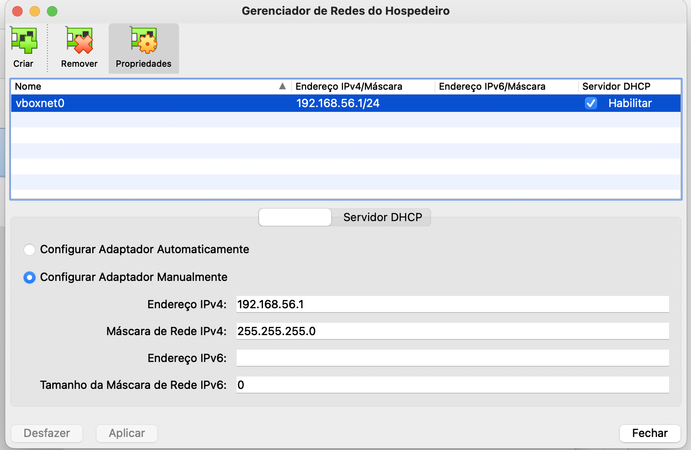
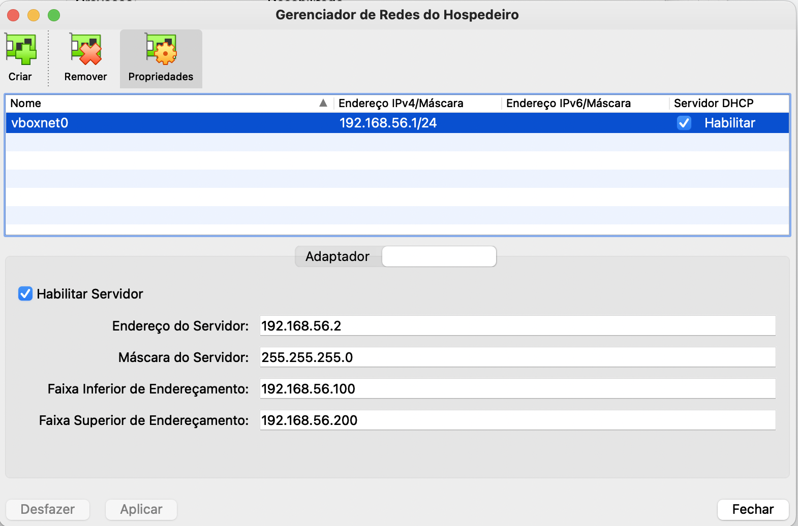
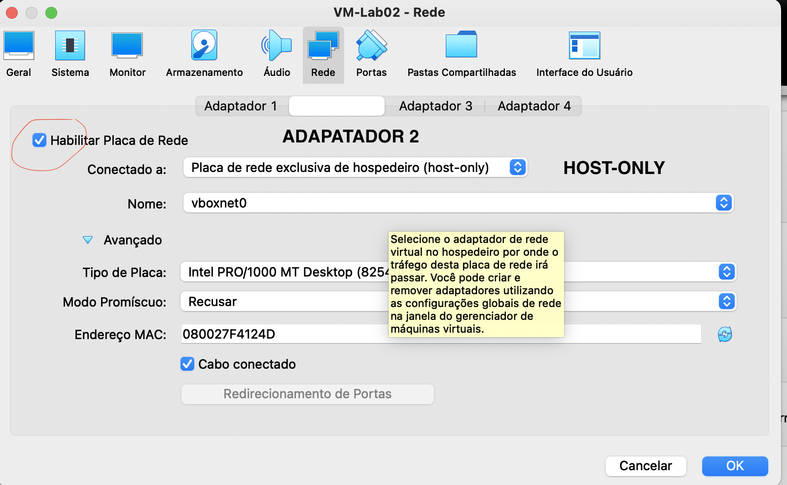
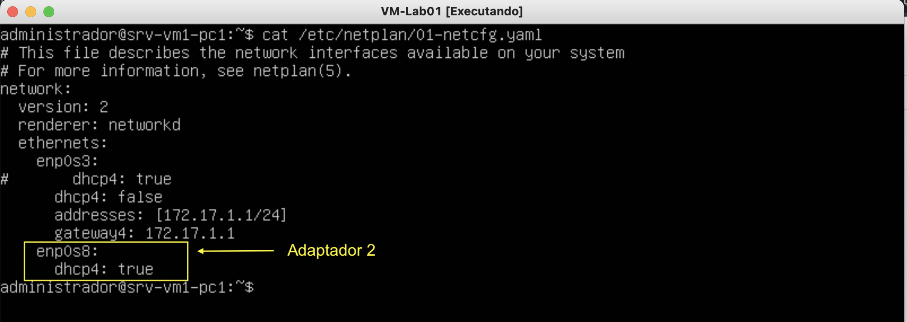
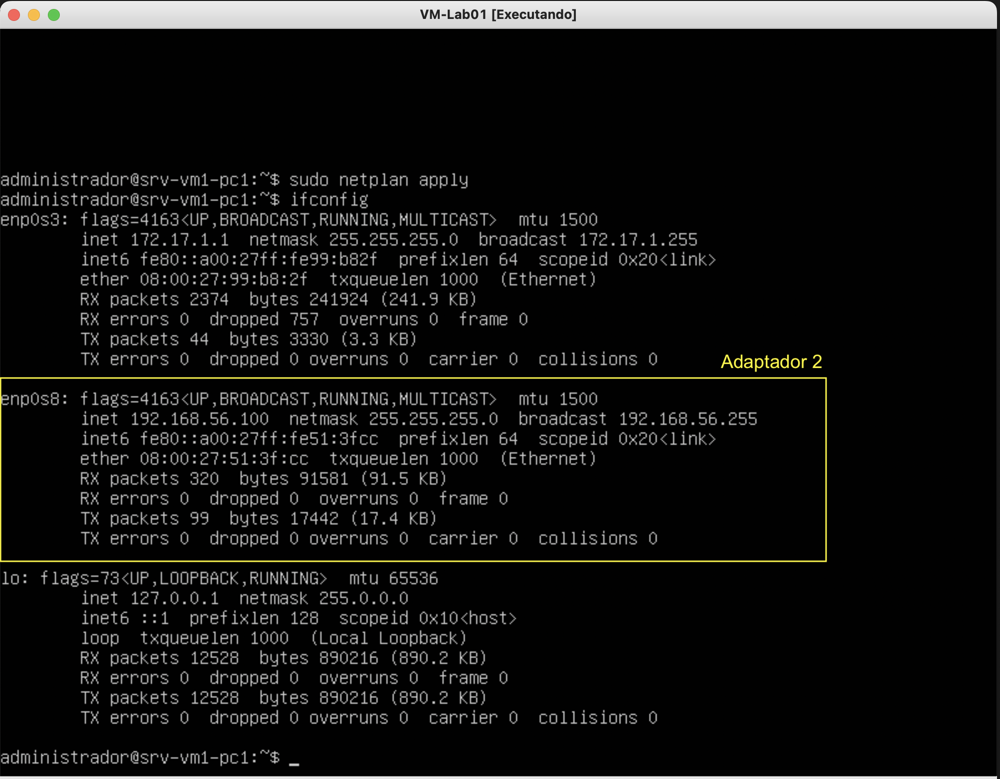

# Acesso Remoto SSH com (Host Only) no Virtual Box

## Objetivo:
    * Configurar o acesso remoto à uma VM pelo terminal do PC via ssh.
    * Porta 22

### Login da VM ubuntu server

* Usuário da VM: ``administrador``
* Senha da VM: ``adminifal``

## 1) Ative ou crie uma interface no computador para comunicação entre o Host (PC) e a VM. 

* Clique em ``Arquivo``->``Host Network Manager``


<p><center> Figura 1: Virtualbox Network Manager</center></p>   
    <br/>


## 2) Configure o servidor DHCP do no adaptador VBoxNet0. 

* Clique em na aba ``Servidor DHCP``


<p><center> Figura 2: Virtualbox Network Manager DHCP</center></p>   
    <br/>

* Verifique a configuração das interfaces usando o ``Terminal``

```shell
ifconfig -a       # verifique a existência da interface ``vboxnet0``
```

## 3) Adicionar um adaptador (HostOnly) em uma VM

* Para dar acesso a uma VM via rede pelo ``Terminal`` do PC devemos adicionar um novo adapatador de rede à VM.

<p><center> Figura 3: Adapatador 2 em modo Host-Only</center></p>   
    <br/>


## 5) Ative as configurações da Interface na VM para o servidor DHCP

* Verifique as interfaces com ``ifconfig -a``

```shell
ifconfig -a       # verifique a existência da interface ``enp0s8``
```


* Configure as interfaces no netplan e ative o DHCO para o Adaptador 2 (enp0s8)

```shell
sudo nano /etc/netplan/01-netcfg.yaml
```

<p><center> Figura 5: Netplan configuration</center></p>   
    <br/>

* ative as configurações:

```shell
sudo netplan apply
```

* cheque se pegou IP na nova interface de rede:

```shell
ifconfig -a
```

<p><center> Figura 4: verificar interfaces com ifconfig</center></p>   
    <br/>

### Acessando uma VM remotamente:

* Exemplo: $ ssh ``<user>``@``<ipServidorRemoto>``
* Fazendo o login 
   * de: terminal-pc
   * para: 192.168.56.101

```shell
ssh administrador@192.168.56.101
```

# Exercício:

1) Acessar uma VM a partir do terminal do PC.
2) A partir da VM acessada faça ssh para as outras VMs da rede interna utilizando os IPs da rede 172.17.1.0

